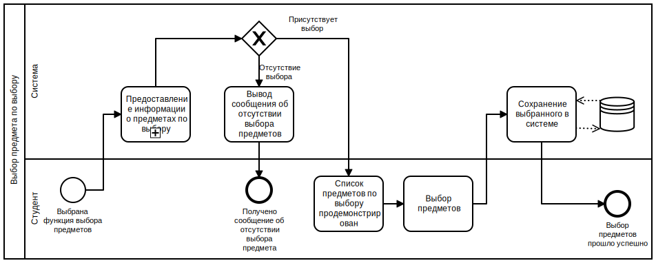

1. [Редактирование информации о научной деятельности](#action1)
2. [Добавление программы занятий](#action2)
3. [Выбор предмета](#action3)
4. [Добавление кафедры](#action4)
5. [Редактирование данных пользователя](#action5)
6. [Добавление информации о научной деятельности](#action6)
7. [Редактирование поля расписания](#action7)
8. [Вход в личный кабинет](#action8)
9. [Удаление пользователя](#action9)
10. [Редактирование программы занятий](#action10)
11. [Назначение преподавателя](#action11)
12. [Редактирование статуса учебного оборудования](#action12)
13. [Удаление учебного оборудования](#action13)
14. [Перевод на следующий курс](#action14)
15. [Добавление филиала](#action15)
16. [Добавление учебного оборудования](#action16)
17. [Выход из личного кабинета](#action17)
18. [Редактирование информации о факультете](#action18)
19. [Добавление специальности](#action19)
20. [Добавление пользователя](#action20)
21. [Редактирование учетных данных](#action21)
22. [Отчисление студентов](#action22)
23. [Добавление факультета](#action23)
24. [Формирование критериев](#action24)
25. [Предоставление информации](#action25)
26. [Редактирование успеваемости студентов](#action26)
27. [Назначение аудитории](#action27)
28. [Редактирование расписания учебной группы](#action28)
29. [Составление списков](#action29)
30. [Редактирование информации о филиале](#action30)
## Редактирование информации о научной деятельности

## Добавление программы занятий

## Выбор предмета

## Добавление кафедры

## Редактирование данных пользователя

## Добавление информации о научной деятельности

## Редактирование поля расписания

## Вход в личный кабинет

## Удаление пользователя

## Редактирование программы занятий

## Назначение преподавателя

## Редактирование статуса учебного оборудования

## Удаление учебного оборудования

## Перевод на следующий курс

## Добавление филиала

## Добавление учебного оборудования

## Выход из личного кабинета

## Редактирование информации о факультете

## Добавление специальности

## Добавление пользователя

## Редактирование учетных данных

## Отчисление студентов

## Добавление факультета

## Формирование критериев

## Предоставление информации

## Редактирование успеваемости студентов

## Назначение аудитории

## Редактирование расписания учебной группы

## Составление списков

## Редактирование информации о филиале

