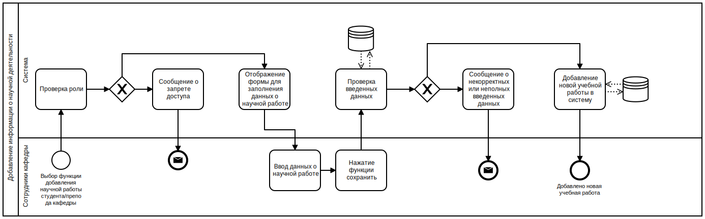
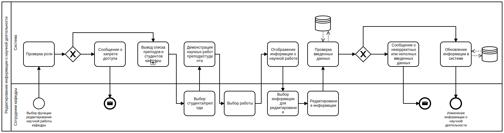
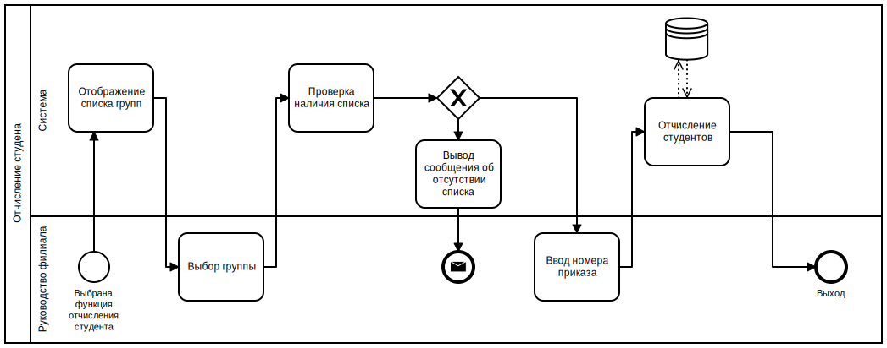
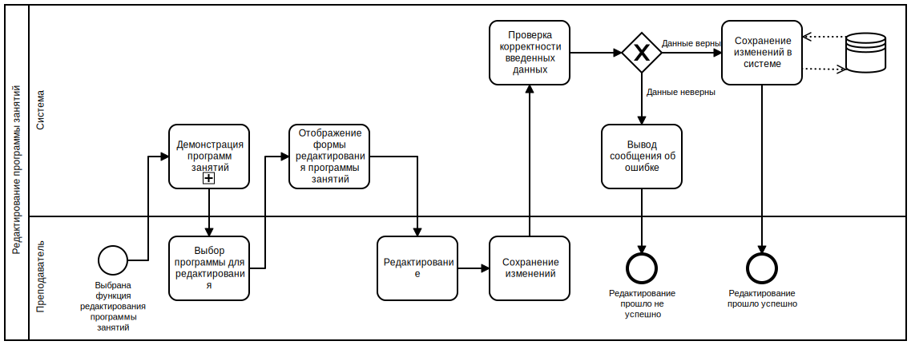
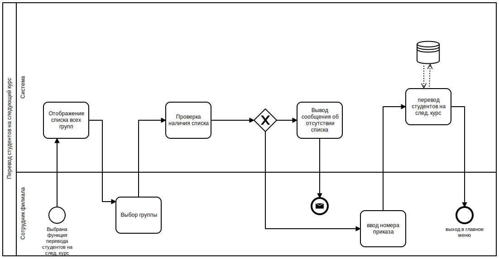

1. [Добавление информации о научной деятельности](#action1)
2. [Редактирование информации о факультете](#action2)
3. [Демонстрация информации о факультетах](#action3)
4. [Выбор предмета](#action4)
5. [Демонстрация информации об успеваемости студентов](#action5)
6. [Добавление учебного оборудования](#action6)
7. [Редактирование расписания учебной группы](#action7)
8. [Редактирование данных пользователя](#action8)
9. [Демонстрация расписания](#action9)
10. [Демонстрация учебного плана](#action10)
11. [Демонстрация личного кабинета](#action11)
12. [Удаление учебного оборудования](#action12)
13. [Составление списка для перевода](#action13)
14. [Составление списка для отчисления](#action14)
15. [Добавление кафедры](#action15)
16. [Редактирование статуса учебного оборудования](#action16)
17. [Демонстрация информации о научной деятельности](#action17)
18. [Добавление программы занятий](#action18)
19. [Редактирование информации о филиале](#action19)
20. [Добавление филиала](#action20)
21. [Добавление факультета](#action21)
22. [Демонстрация списка для отчисления](#action22)
23. [Удаление пользователя](#action23)
24. [Составление списка для стипендии](#action24)
25. [Редактирование информации о научной деятельности](#action25)
26. [Демонстрация информации о специальностях](#action26)
27. [Назначение преподавателя](#action27)
28. [Назначение стипендии](#action28)
29. [Отчисление студентов](#action29)
30. [Редактирование программы занятий](#action30)
31. [Демонстрация списка специальностей](#action31)
32. [Выбор предметов](#action32)
33. [Демонстрация предметов по выбору](#action33)
34. [Демонстрация информации о филиалах](#action34)
35. [Демонстрация списка для назначения стипендии](#action35)
36. [Демонстрация личной успеваемости](#action36)
37. [Демонстраци информации об учебном оборудовании](#action37)
38. [Редактирование успеваемости студентов](#action38)
39. [Демонстрация списка для перевода](#action39)
40. [Авторизация](#action40)
41. [Выход из личного кабинета](#action41)
42. [Добавление специальности](#action42)
43. [Демонстрация информации о филиале](#action43)
44. [Демонстрация программы занятий](#action44)
45. [Перевод на следующий курс](#action45)
46. [Демонстрация успеваемости студентов](#action46)
47. [Назначение аудитории](#action47)
48. [Добавление пользователя](#action48)
49. [Редактирование учетных данных](#action49)
## Добавление информации о научной деятельности

## Редактирование информации о факультете

## Демонстрация информации о факультетах

## Выбор предмета

## Демонстрация информации об успеваемости студентов

## Добавление учебного оборудования

## Редактирование расписания учебной группы

## Редактирование данных пользователя

## Демонстрация расписания

## Демонстрация учебного плана

## Демонстрация личного кабинета

## Удаление учебного оборудования

## Составление списка для перевода

## Составление списка для отчисления

## Добавление кафедры

## Редактирование статуса учебного оборудования

## Демонстрация информации о научной деятельности

## Добавление программы занятий

## Редактирование информации о филиале

## Добавление филиала

## Добавление факультета

## Демонстрация списка для отчисления

## Удаление пользователя

## Составление списка для стипендии

## Редактирование информации о научной деятельности

## Демонстрация информации о специальностях

## Назначение преподавателя

## Назначение стипендии

## Отчисление студентов

## Редактирование программы занятий

## Демонстрация списка специальностей

## Выбор предметов

## Демонстрация предметов по выбору

## Демонстрация информации о филиалах

## Демонстрация списка для назначения стипендии

## Демонстрация личной успеваемости

## Демонстраци информации об учебном оборудовании

## Редактирование успеваемости студентов

## Демонстрация списка для перевода

## Авторизация

## Выход из личного кабинета

## Добавление специальности

## Демонстрация информации о филиале

## Демонстрация программы занятий

## Перевод на следующий курс

## Демонстрация успеваемости студентов

## Назначение аудитории

## Добавление пользователя

## Редактирование учетных данных

